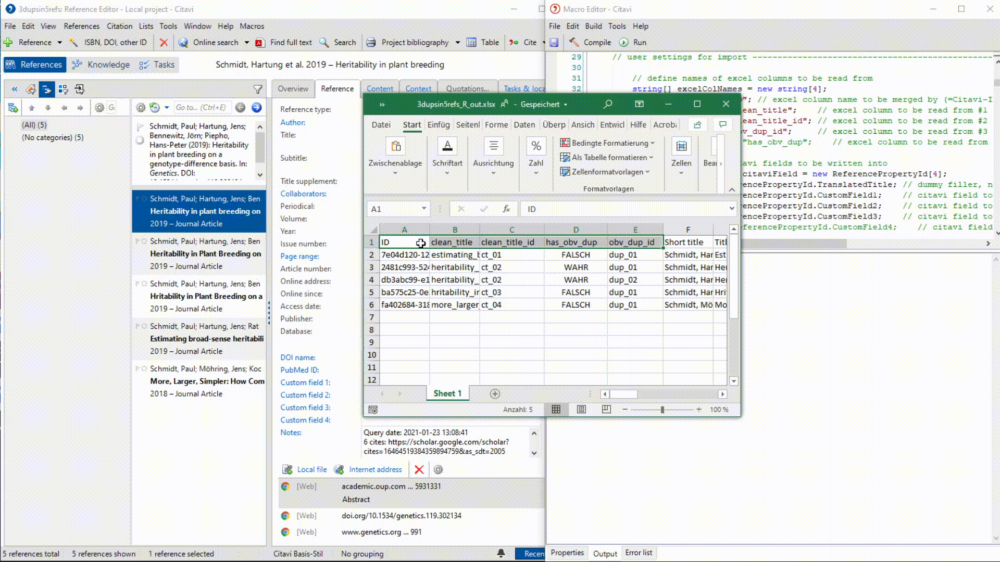

# CIMR 001 Import: find_obvious_dups
Custom Citavi macro that imports the results created by the `find_obvious_dups()` function of the [`CitaviR` package](https://github.com/SchmidtPaul/CitaviR#citavir-).



The excel file shown above can be created as:

```{r ,message = FALSE, warning = FALSE, error = FALSE}
library(CitaviR)

path   <- example_xlsx('3dupsin5refs.xlsx') # replace with path to your xlsx file

read_Citavi_xlsx(path) %>% # imports 3dupsin5refs.xlsx
  find_obvious_dups() %>%  # adds columns "clean_title", "clean_title_id", "has_obv_dup", "obv_dup_id"
  write_Citavi_xlsx(path)  # creates 3dupsin5refs_R_out.xlsx
```

Which excel columns should be imported into which Citavi fields can be changed by editing the [user settings for import](https://github.com/SchmidtPaul/CitaviRMacros/blob/bda164893591000f2677c23dbb5776bd8d8dacbe/CIMR%20Import/CIMR%20001/CIMR%20001%20Import%20obvious_dup%20info.cs#L29) section of the macro. 